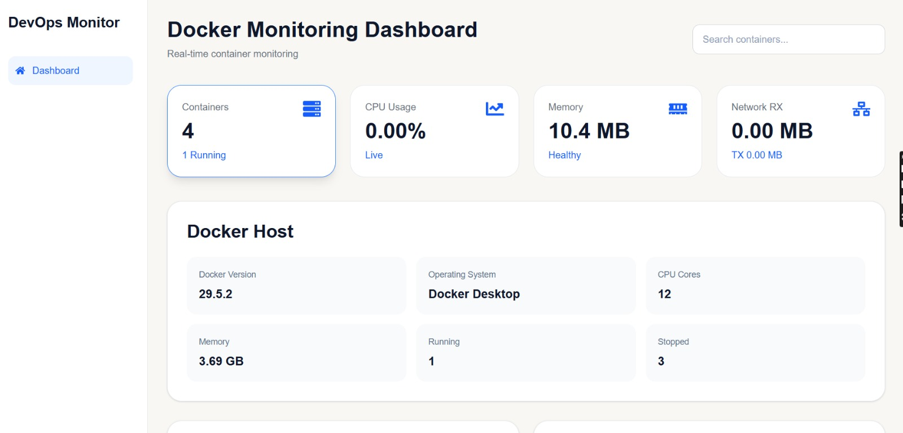
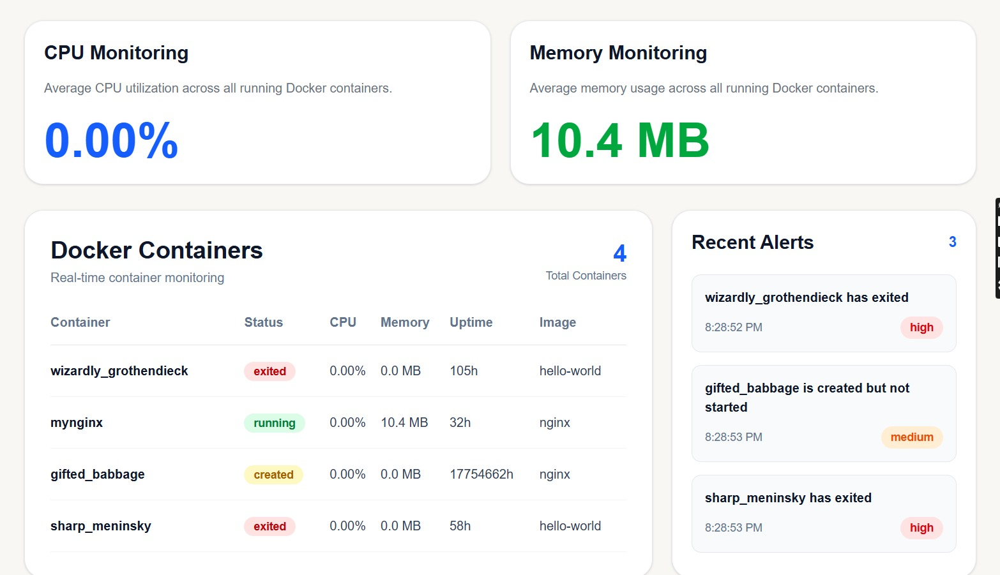
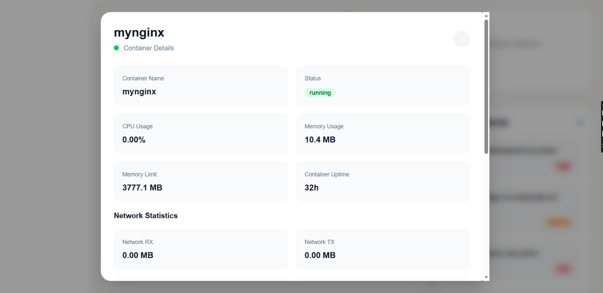
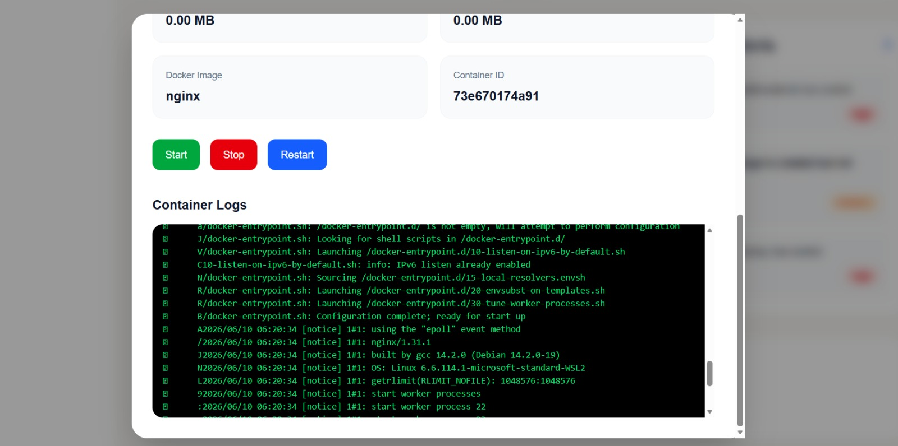

# 🚀 DevOps Monitoring Platform

A modern Docker container monitoring dashboard built with React, Node.js, Express, Dockerode, and Chart.js.

## Live Demo

Frontend Deployment:
(https://devops-monitoring-platform-v84c.vercel.app/)

This platform provides real-time visibility into Docker containers, resource utilization, logs, alerts, and container lifecycle operations through a clean and responsive dashboard interface.

---

## 📸 Project Screenshots

### Dashboard Overview

### Containers & Details

### Container Details

### Container Logs

---

## ✨ Features

* Real-time Docker container monitoring
* CPU usage tracking
* Memory utilization monitoring
* Network RX/TX statistics
* Container lifecycle management

  * Start
  * Stop
  * Restart
* Container details viewer
* Container logs viewer
* Alerts monitoring
* Search and filtering functionality
* Responsive dashboard design

---

## 🛠 Tech Stack

### Frontend

* React
* Vite
* Tailwind CSS
* Chart.js
* React Icons

### Backend

* Node.js
* Express.js
* Dockerode

### DevOps & Tools

* Docker
* Git
* GitHub
* Vercel

---

## 🏗 Architecture

Docker Engine → Express API → React Dashboard

---

## 🚀 Future Enhancements

* Prometheus Integration
* Grafana Dashboards
* Historical Metrics Storage
* Authentication & Authorization
* Kubernetes Monitoring
* WebSocket-based Live Updates

---

## 👨‍💻 Author

Aditya Desai

GitHub: https://github.com/adidesai43453
